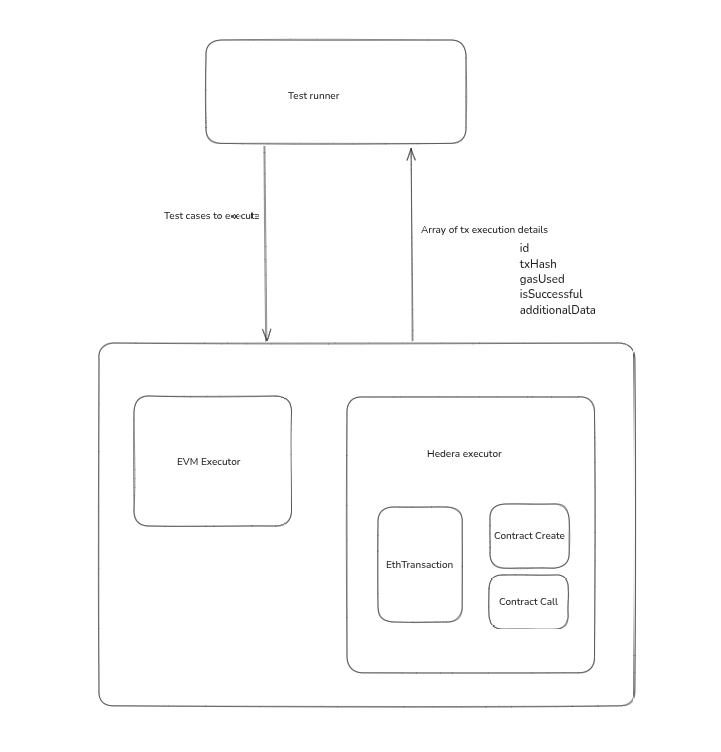
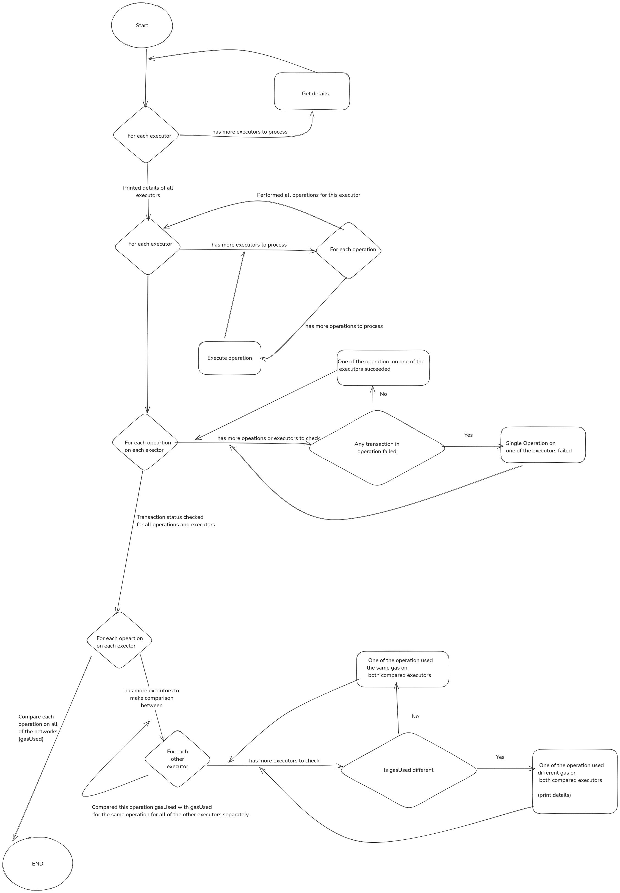
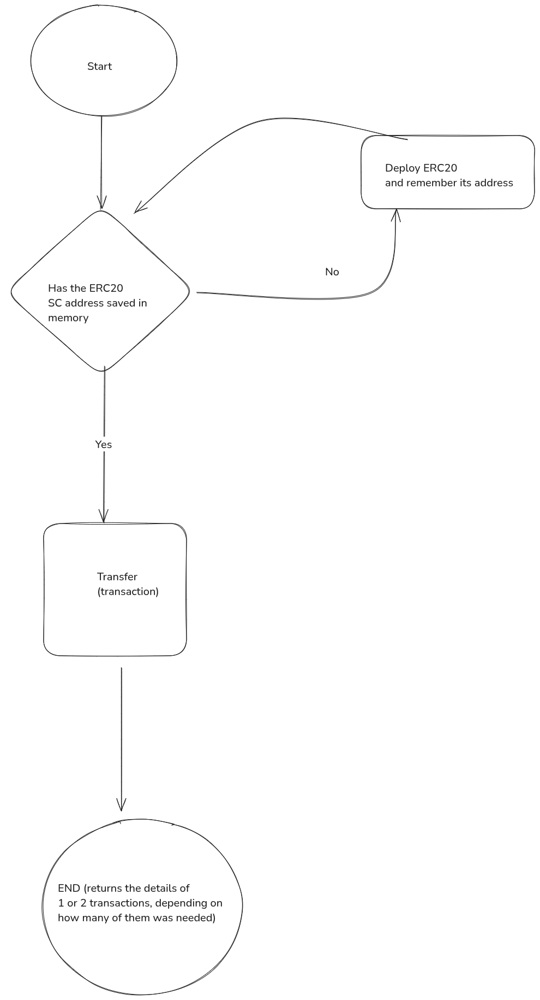

# ADR 001: EVM Gas schedule compatibility regression framework

## Context and problem statement

Hedera’s EVM-compatible smart contracts use a gas accounting model that differs in subtle but material
ways from Ethereum’s. For non-native contracts, we want to ensure parity or a configurable tolerance,
between Hedera and any Ethereum-compatible chain’s gas consumption patterns.
This project will deliver a test harness and framework to compare gas usage across networks,
helping engineering teams diagnose discrepancies, optimize gas costs, and maintain consistency across chains.

### Decision Drivers

 - Parity Verification: Provide automated, repeatable tests to verify that non-native Hedera contract operations consume gas equivalent to Ethereum (within configurable tolerances).
 - Configurable Tolerance: Allow per-use-case or global percentage thresholds for acceptable gas variance (e.g., passes if Hedera gas ≤ 70% of Ethereum gas by default).
 - Comprehensive Coverage: Support a broad suite of functional use cases, from contract creation (CREATE/CREATE2) to common token interactions (ERC‑20, ERC‑721), delegate calls, and more.
 - Actionable Diagnostics: When tests fail, emit detailed gas-difference reports, including optional opcode-level traces to pinpoint root causes.
 - Developer Experience: Single-command execution, clear console output (and optional file output).


## Considered Options

* **Implement executor-based solution for the EVM Gas schedule compatibility regression framework.**
* **Use JavaScript to implement all system components.**
* ~~Use the test runner written in the Foundry.~~
* ~~Use the forge script to handle the EVM executor logic.~~
* ~~Implement the solution in monolithic architecture.~~

### Implement executor-based solution for the EVM Gas schedule compatibility regression framework



The system comprises three independent components, each dedicated to specific responsibilities:

#### 1. Test Runner

The Test Runner performs the following functions:

- Accepts user input specifying executors and operations to execute (each operation will be executed on each executor).
- Requests and displays details of each executor, including name, configuration, client details, and network information.
- Sends specific operation requests to each executor. Executors receive only a list of operations (by name or code) that need execution. Each operation represents functionality intended for testing (like: 'erc20::approve', 'erc721::transferFrom').
- Upon receiving responses from executors, performs transaction comparisons. Executors return an array containing transaction details:
    - Transaction ID
    - transaction hash (txHash)
    - gas used, success status (isSuccessful)
    - and additional data.
  The test runner conducts the following checks:
    - Confirms all transactions were successful. If any operation is unsuccessful, its corresponding test fails.
    - Compares the gas usage for the critical (final) transaction executed by the executor during operation. If transaction costs differ across executors, the test fails only for the mismatched executors.

#### 2. Executors
Two types of executors are defined:

1. EVM Executor
- Executes requested operations using the JSON-RPC interface.
- Multiple instances may be utilized, each configured with a unique JSON-RPC API URL and a set of private keys associated with accounts sufficiently funded to perform operations.
- Each operation corresponds to an atomic test represented by a single blockchain transaction, but executors independently handle any prerequisite steps necessary for execution (e.g., user account creation, smart contract deployment, token mining).
- Allows storing certain outputs between tests to optimize performance and reduce costs. For example, after an initial smart contract deployment, the contract address may be saved and reused in subsequent tests to eliminate redundant deployment steps.

2. Hedera Executor
- Requires different inputs, such as Hedera account ids.
- May involve additional preparation steps, such as account creation, necessary for executing operations.
- Communicates via a Hedera SDK, necessitating configuration with a consensus node's address and port.

Both executor types must be capable of:
- Processing operation execution requests (operation identified by name or code) and responding with transaction details in the standardized format described above.
- Responding to queries regarding their configuration details, primarily network information.

To mitigate one of the previously mentioned negative effects, the proposed technology stack is as follows:
1. JavaScript with the Ethers library for the EVM executor
2. JavaScript with the Hedera SDK for the Hedera executor
3. JavaScript with Chai as the test runner

By applying the proposed architecture, it still remains possible to eventually integrate an additional executor that runs tests using Foundry.
While not necessary, this could be beneficial in the future, as Foundry includes tools for gas usage analysis that may prove useful.

Same executor details to be displayed:
```bash
    Executor: EVM Executor
    Network name: Hedera
    Chain id: 296
    Current fork details
    Block number: 18645758
    Block timestamp: 1745334322
    Network software version: relay/0.67.0
```

Test run:


Operation execution (transfer of erc20 as an example):



### Use JavaScript to implement all system components.

A PoC using a test runner written in Foundry was also implemented. However, continuing with this approach would introduce additional complexity.
Communication with other services from within Solidity requires the use of the FFI (Foreign Function Interface), which, in our case,
currently depends on having Bash available on the runner's OS. This makes execution impossible on systems like Windows - unless the application is run in a Dockerized environment.
Additionally, all curl requests were handled via Bash at the CLI level, adding another layer of complexity.
For these reasons, this ADR proposes implementing the test runner in JavaScript instead, to simplify the solution.

### Consequences

* Good, because it allows the developers to freely choose the technology for each of the components to be implemented.
* Good, because the Hedera native executor might utilize the existing JS library, which can also be used for the tests.
* Good, because there are already multiple existing tools that could serve as an EVM executor, such as Forge script.
* It might require the use of two (or more) different technologies, such as:
  - vanilla JS with the Hedera SDK,
  - Solidity with Foundry
    to work correctly.

This negative effect could be mitigated by implementing the complete solution using (for all the components in this architecture) a single technology that has a Hedera SDK available (such as JavaScript) .


### Use the test runner written in the Foundry.

Our previously prepared PoC utilized the benefits of executor-based logic but relied on the test runner written in Foundry.
This approach proved to add extra complexity to the development process without providing meaningful benefits.

### Consequences

The Foundry test runner would require us to write tests in Solidity.
To communicate with other components and microservices, we would have to rely on the Foreign Function Interface (FFI).
FFI (Foreign Function Interface) allows Foundry tests to call external programs or scripts outside the Ethereum Virtual Machine (EVM).
This enables interactions with non-Solidity components, such as microservices or external APIs. However, using FFI introduces additional complexity,
potential security risks, and may slow down the testing process.

Since we are running system function commands, we must be aware of the environment in which we are executing them.
For example, a Windows - based operating system may not have a Bash interface available, and even if Bash is installed,
access to certain OS utilities like curl is not guaranteed.
This means that at the execution level (when FFI is actually utilized), we are effectively unaware of what will truly
happen and what impact it might have on our script.
Such uncertainty introduces additional risks and potential inconsistencies during test execution.

This communication layer between components would be further complicated because, at the Solidity level, the client calling the FFI interface must receive an ABI-encoded response in a known format.
If it does not receive a hex-encoded response, it will not be able to recover any data from it.
Even if it does receive hex-encoded data (the only format Solidity memory can store), it must always represent the ABI encoding of a predefined and known type.
An example of this requirement can be seen in a popular Forge library that implements curl usage for Forge: [memester-xyz/surl – Surl.sol, line 91](https://github.com/memester-xyz/surl/blob/master/src/Surl.sol#L91)
In this example, the response body and status code from curl are passed as parameters to the cast abi-encode call, ensuring the data is formatted in a way that Solidity can understand.
This adds an additional layer of data formatting that would need to be implemented for all components communicating with the Forge test runner via FFI.

### Use the forge script to handle the EVM executor logic.

By default, Foundry uses its own local virtual environment (EVM) to run tests.
This setup provides powerful features like advanced gas usage reporting and opcode-level checks - capabilities that could be very valuable to us.
However, our goal is not to compare the behavior between two runs on Foundry's local environment.
Instead, we want to accurately measure the actual gas usage difference between executing transactions on two different remote EVMs (e.g., Hedera and Sepolia).

To achieve this, we need to broadcast transactions to real networks, rather than simulating them locally on Foundry's EVM.
In Foundry, broadcasting transactions is only possible through the Forge Script interface (forge script), not through forge test runs.

When we use forge script, the detailed local gas reports are no longer available - because the transaction executes remotely, and Foundry cannot track low-level execution details outside its environment.
This does not make using Forge Script a worse option, but it also does not provide any advantage over other approaches (e.g., using ethers.js).

### Consequences

Since the end result would be the same regardless of whether we use Forge Script or ethers.js, we might as well use the technology that have the Hashgraph SDK implemented.
This would reduce the number of technologies contributors need to know, simplifying development, onboarding.

### Implement the solution in monolithic architecture.

We could apply an architecture based on a single technology and simply write all tests for the scenarios we want to verify.
For example, we could first run the tests against the JSON-RPC API, then against another RPC API, and finally against the SDK or any other component we want to test.

### Consequences

This approach may simplify and speed up the development process for us in the short term. However, in the future, it would lock us into the chosen technology and prevent us from leveraging the benefits of other technologies.
If we adopt a multi-component architecture, we will have the flexibility to add new executors in any technology we choose. For example, it would even be possible to compare total gas usage between SDK clients written in different programming languages, if the need ever arises.

## Decision Outcome

We propose moving forward with a JavaScript-based implementation for all components, with executors implemented as separate components.
This includes:
- EVM Executor using Ethers.js
- Hedera Executor using Hedera SDK (JavaScript)
- Test Runner using JavaScript with Chai

This simplifies cross-platform compatibility, improves developer experience, and minimizes toolchain complexity. Foundry integration remains a possible enhancement in the future.
