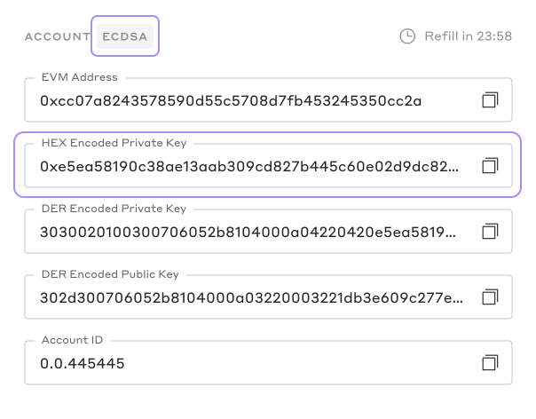
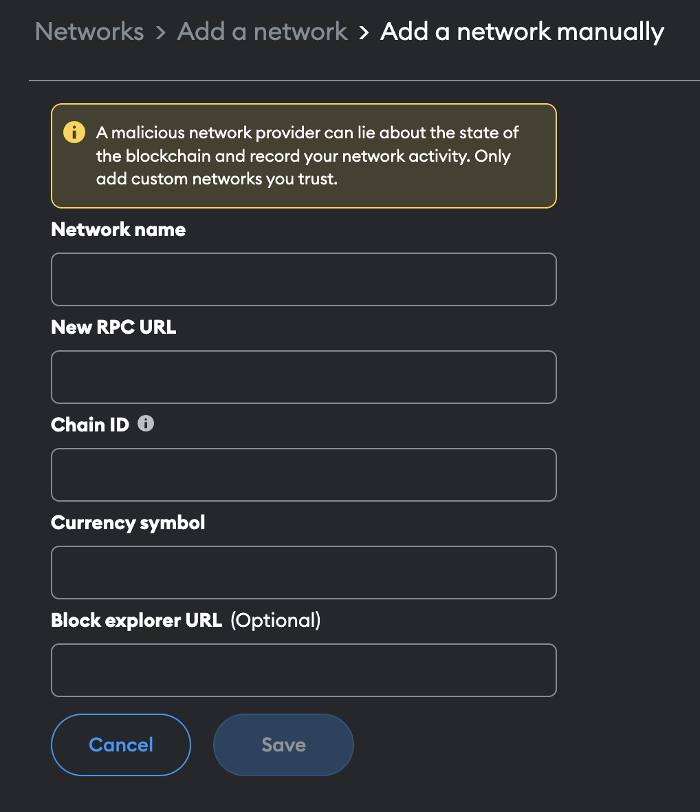

<p align="center">
<br />
<a href="https://hedera.com/">
<h1 align="center"> Hedera System Smart Contracts Dapp Playground </h1>
<h5 align="center"> 🪜 Work In Progress... 🪜</h5>
</p>

## Overview

An intuitive low-code playground that eliminates the complexities, reduces learning curves, and allows developers to effortlessly interact with the Hedera’s powerful system contracts.

## Getting started

### Requirements

- [git](https://git-scm.com/)
- [npm](https://www.npmjs.com/)
- [nodejs](https://nodejs.org/en/)
- [contributing guide](https://github.com/hashgraph/.github/blob/main/CONTRIBUTING.md#pull-requests)
- [Metamask wallet plugin](https://metamask.io/download/)
- [prettier plugin](https://prettier.io/) (recommended)

## Quickstart

```
git clone https://github.com/hashgraph/hedera-smart-contracts.git
cd ./hedera-smart-contracts/system-contract-dapp-playground
npm install
```

## Initial account and wallet setup (important)

**_Important_**: Before proceeding, ensure your `Metamask wallet` points to the correct `Hedera network` (localnet, previewnet, testnet or mainnet) and is associated with a valid ECDSA based `Hedera account` that was auto-created or lazy-created with an evmAddress alias set as highlighted in [HIP 583](https://hips.hedera.com/hip/hip-583). This is crucial for the project's proper functioning. If you haven't configured these settings yet, please follow the guidelines below.

**_note_**: The information shared below is specifically targeted at individuals who do not currently hold a `Hedera Portal` account and/or have not connected the `Hedera network` to their `Metamask` wallet. Feel free to proceed directly to [Project Execution](README.md#project-execution) if you have already configured your Hedera account and Metamask wallet appropriately

#### 1. Create Hedera Portal Profile

- Visit the [Hedera Portal](https://portal.hedera.com/register), follow the instructions to create a **_Hedera Test_** account on previewnet or testnet.

- Once you have completed the instructions, you will receive a Hedera account ID (0.0.x) and your private/public key pair on your portal page. You will need to save the **_HEX Encoded Private Key_** as later, we will be using it to import the account into your `Metamask` wallet.



**_Important_**: While Hedera supports both ECDSA and ED25519 accounts, please use ECDSA since the EVM is designed to operate with ECDSA accounts.

#### 2. Wallet setup (Metamask)

- Inside your `Metamask` wallet, navigate to Settings > Networks > Add network > Add a network manually. A form will appear, where you can input the required network details. It should look similar to the following:



- Please use the provided information below to complete the form and add the desired network based on environment.

##### a. Hedera Mainnet

| Field              | Data                                  |
| ------------------ | ------------------------------------- |
| Network name       | Hedera Mainnet                        |
| New RPC URL        | https://mainnet.hashio.io/api         |
| Chain ID           | 295                                   |
| Currency symbol    | HBAR                                  |
| Block explorer URL | https://hashscan.io/mainnet/dashboard |

##### b. Hedera Testnet

| Field              | Data                                  |
| ------------------ | ------------------------------------- |
| Network name       | Hedera Testnet                        |
| New RPC URL        | https://testnet.hashio.io/api         |
| Chain ID           | 296                                   |
| Currency symbol    | HBAR                                  |
| Block explorer URL | https://hashscan.io/testnet/dashboard |

##### c. Hedera Previewnet

| Field              | Data                                     |
| ------------------ | ---------------------------------------- |
| Network name       | Hedera Previewnet                        |
| New RPC URL        | https://previewnet.hashio.io/api         |
| Chain ID           | 297                                      |
| Currency symbol    | HBAR                                     |
| Block explorer URL | https://hashscan.io/previewnet/dashboard |

##### d. Hedera Localnet

**_important_**: Before proceeding to add `Localnet` to your Metamask, please ensure that an instance of a `Hedera local node` is running. Follow this [guides](https://github.com/hashgraph/hedera-local-node#installation) to set up and run a `Hedera local node`.

| Field              | Data                  |
| ------------------ | --------------------- |
| Network name       | Hedera Localnet       |
| New RPC URL        | http://localhost:7546 |
| Chain ID           | 298                   |
| Currency symbol    | HBAR                  |
| Block explorer URL | http://localhost:8080 |

#### 3. Import Hedera account to Metamask

Please follow this [instruction here](https://support.metamask.io/hc/en-us/articles/360015489331-How-to-import-an-account) on how to import your account to Metamask using your **_HEX Encoded Private Key_** found in your Hedera Portal profile.

## Project Prerequisite Check for Contract Assets

**_note_**: The DApp Playground requires smart contract metadata in the root `/hedera-smart-contracts project` to retrieve bytecode for deployment and ABI for decoding details. To ensure all the necessary smart contract assets are up-to-date, please follow the steps below:

1.  From the root directory (`hedera-smart-contract`), run the below commands to compile the smart contracts

```
  npm install && npx hardhat compile
```

2.  Now, navigate back to the `system-contract-dapp-playground` directory and execute the `prerequisite-check` command using npm:

```
  npm run prerequisite-check
```

**_note_**: After executing the command, if all the necessary assets are present, you will see the following message:

```
✅ Validation successful! Contract assets are available! ✅
```

Congratulations! You are now ready to execute the project!

## Project Execution

### Running the project locally

```
  npm run dev
```

### Building the project

```
  npm run build
```

### Starting production-ready build

```
  npm run start
```

**_important_**: must [build the project](README.md#building-the-project) first.
