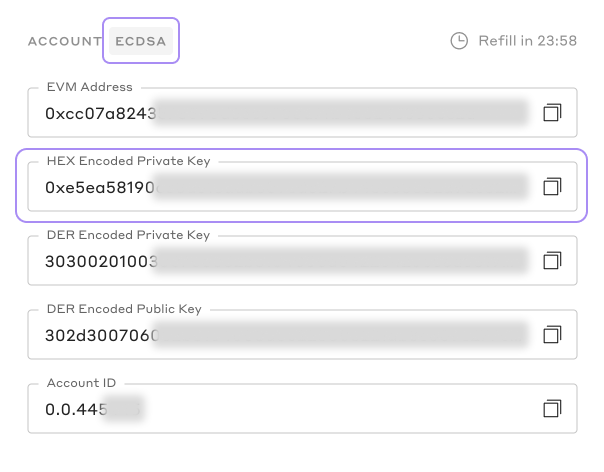

<p align="center">
<br />
<a href="https://hedera.com/">
<h1 align="center"> Hedera System Smart Contracts Dapp Playground </h1>
<h5 align="center"> 🪜 Work In Progress... 🪜</h5>
</p>

## Overview

TBD

## Getting started

### Requirements

- [git](https://git-scm.com/)
- [npm](https://www.npmjs.com/)
- [nodejs](https://nodejs.org/en/)
- [contributing guide](https://github.com/hashgraph/.github/blob/main/CONTRIBUTING.md#pull-requests)
- [Metamask wallet pluggin](https://metamask.io/download/)
- [prettier pluggin](https://prettier.io/) (recommended)

## Quickstart

```
git clone https://github.com/hashgraph/hedera-smart-contracts.git
cd ./hedera-smart-contracts/system-contract-dapp-playground
npm install
```

## Initial account and wallet setup (important)

**_Important_**: Before proceeding, ensure your `Metamask wallet` points to the correct `Hedera network` (testnet or previewnet) and is associated with a valid `Hedera account` (auto-created or lazy-created). This is crucial for the project's proper functioning. If you haven't configured these settings yet, please follow the guidelines below.

**_note_**: The information shared below is specifically targeted at individuals who do not currently hold a `Hedera Portal` account and/or have not connected the `Hedera network` to their `Metamask` wallet.

#### 1. Create Hedera Portal Profile

- Visit the [Hedera Portal](https://portal.hedera.com/register), follow the instructions to create a **_Hedera Testnet_** account.

- Once you have completed the instructions, you will receive a Hedera Testnet account ID (0.0.x) and your private/public key pair on your testnet page. You will need to save the **_HEX Encoded Private Key_** as later, we will be using it to import the account into your `Metamask` wallet.



**_Important_**: While Hedera supports both ECDSA and ED25519 accounts, please use ECDSA since Ethereum only supports ECDSA.

#### 2. Wallet setup (Metamask)

- Inside your `Metamask` wallet, navigate to Settings > Networks > Add network > Add a network manually. A form will appear, where you can input the required network details. It should look similar to the following:


- Please use the provided information below to complete the form and add the `testnet` network.

| Field              | Data                                  |
| ------------------ | ------------------------------------- |
| Network name       | Hedera Testnet                        |
| New RPC URL        | https://testnet.hashio.io/api         |
| Chain ID           | 296                                   |
| Currency symbol    | HBAR                                  |
| Block explorer URL | https://hashscan.io/testnet/dashboard |

- Hit `Save` to save the network to your `Metamask` wallet.

- Repeat the same process to add the `previewnet` network using the information below.

| Field              | Data                                     |
| ------------------ | ---------------------------------------- |
| Network name       | Hedera Previewnet                        |
| New RPC URL        | https://previewnet.hashio.io/api         |
| Chain ID           | 297                                      |
| Currency symbol    | HBAR                                     |
| Block explorer URL | https://hashscan.io/previewnet/dashboard |

## Project Execution

### Running the project locally

```
  npm run dev
```

### Building the project

```
  npm run build
```

### Starting production-ready build

```
  npm run start
```

**_important_**: must [build the project](README.md#building-the-project) first.

## Config

| Config files                             | Purpose                                                                                                                                                                                                                                     |
| ---------------------------------------- | ------------------------------------------------------------------------------------------------------------------------------------------------------------------------------------------------------------------------------------------- |
| [next-env.d.ts](next-env.d.ts)           | a declaration file that allows to extend the global TypeScript types and declare custom types specific to Next.js project. This file ensures that TypeScript correctly recognizes Next.js-specific types and prevents type-checking errors. |
| [next.config.js](next.config.js)         | allows to customize the Next.js configuration, including settings for features, plugins, environment variables, and webpack behavior.                                                                                                       |
| [postcss.config.js](postcss.config.js)   | specifies the PostCSS plugins and their settings used to process and transform CSS code during the build process.                                                                                                                           |
| [tailwind.config.js](tailwind.config.js) | allows to customize Tailwind CSS by providing options to modify colors, fonts, breakpoints, variants, and more, tailoring the framework to specific project requirements.                                                                   |
| [tsconfig.json](tsconfig.json)           | configures the TypeScript compiler settings, enabling to specify target environments, module systems, and other options, ensuring type-checking and compilation of TypeScript code for the project.                                         |
