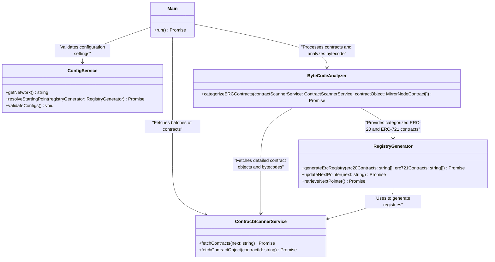

# ERC Contracts Indexer

## Abstract

This document outlines the design and implementation of the **ERC Contracts Indexer**, a standalone tool for identifying and cataloging ERC20 and ERC721 token contracts on the Hedera network. The indexer will index the Hedera network and scan contracts, verify their adherence to ERC standards, and produce structured output files for downstream applications. The goal is to provide developers and users with a reliable registry of tokens to enhance network insight and application usability.

## Motivation

Hedera supports ERC tokens alongside its native HTS tokens. However, there is no built-in mechanism to identify and list ERC20 and ERC721 tokens on the network. This lack of visibility impacts the usability of tools like the Mirror Node Explorer and limits the ability of developers to interact with these tokens.

The **ERC Contract Indexer** addresses this gap by:

1. **Providing Discoverability**: Enabling tools to display and interact with ERC tokens effectively.
2. **Automating Identification**: Streamlining the process of detecting and validating token contracts.
3. **Serving as a Foundation**: Establishing a structured dataset for broader ecosystem enhancements.

## Design

### Tool Overview

The **ERC Contract Indexer** will:

- Fetch smart contracts from the Hedera network using Mirror Node APIs.
- Detect ERC20 and ERC721 token contracts by performing function signature matching.
- Optionally validate contracts via `eth_call` for additional confidence.
- Finally, generate two registries in the format of JSON: one for ERC20 tokens and another for ERC721 tokens.

### Architecture

#### 1. **ERC Interface Signature Matcher**

- **Objective**: Leverage Hedera Mirror Node APIs to retrieve and analyze all smart contracts on the Hedera network. Validate the bytecode of each contract through signature matching to determine compliance with the ERC-20 or ERC-721 standard.
- **Limitations**: While effective, this method may fail to detect some contracts, such as those that implement ERC standards in unconventional ways. For this reason, Step 2 (Validator) is optionally included to increase confidence and accuracy.
- **Output**: A comprehensive list of verified ERC-20 and ERC-721 compliant contracts.

#### 2. **Validator** (Optional)

- **Purpose**: To increase confidence and catch contracts that might have been missed in Step 1.
- **Output**: Filtered and validated list of ERC tokens.

#### 3. **Registry Generator**

- **Purpose**: Generate output files in the required format.
- **Output**: JSON files:
  - `ERC20_registry.json`
  - `ERC721_registry.json`

#### 4. **Configuration Manager**

- **Purpose**: Enable flexible and environment-specific configurations.
- **Parameters**:
  - `HEDERA_NETWORK`: Network environment (e.g., testnet, mainnet).
  - `MIRROR_NODE_URL`: API URL for the Hedera mirror node.
  - `STARTING_POINT`: Starting contract ID or contract EVM address (or a `next` pointer from a previous run).

### Class Diagram

The following class diagram illustrates the code structure and relationships between the components of the ERC Contracts Indexer tool:



### Implementation Workflow

1. **Initialization**:

   - Load environment variables and configuration parameters.

2. **Identifying ERCs**:

   a. **Retrieve Contract Batches**:

   - Use the Hedera Mirror Node API to index the entire network, retrieving contracts in ascending order (from oldest to newest):
     - `https://{{network}}.mirrornode.hedera.com/api/v1/contracts?order=asc`

   b. **Fetch Contract Details and Parse Bytecode**:

   - For each contract:
     - Retrieve contract details:
       - `https://{{network}}.mirrornode.hedera.com/api/v1/contracts/{contractIdOrEvmAddress}`
     - Extract and parse the bytecode from the contract detail object.
       _Note: Utilize concurrent requests to optimize execution efficiency._

   c. **Perform Interface Signature Matching**:

   - Perform bytecode analysis for ERC-20 and ERC-721 compliance using a regex-based approach. This method utilizes positive lookahead assertions to match all requisite function selectors and event topics directly within the bytecode, ensuring accurate interface validation.

   d. **Handle Pagination**:

   - Since the `/contracts` endpoint has a limit of 100 records per request, use the `next` pointer provided in the response to recursively fetch subsequent batches and comprehensively index the network.
   - Write the `next` pointer to disk for persistence, allowing the indexing process to resume from the last recorded point if interrupted or to accommodate future runs when additional contracts are deployed on the network.

3. **Validation (Optional)**:

   - Perform `eth_call` on detected contracts to confirm:
     - ERC20:
       - `name`, `symbol`, `decimals`, `totalSupply`.
     - ERC721:
       - `name`, `symbol`.
   - Filter out contracts that fail validation.

4. **Registry Generation**:
   - Aggregate validated contracts into two separate registries:
     - **ERC20**:
       ```json
       [
         {
           "address": "0x....",
           "contractId": "0.0.x",
           "name": "...",
           "symbol": "...",
           "decimals": x,
           "totalSupply": "..."
         }
       ]
       ```
     - **ERC721**:
       ```json
       [
         {
           "address": "0x....",
           "contractId": "0.0.x",
           "name": "...",
           "symbol": "...",
           "serial_id": "..."
         }
       ]
       ```
   - Sort entries in ascending order of `contractId`.
   - Save output files to `tools/erc-repository-indexer/registry`.

---

## Future Features

1. **Bytecode Storage**:

   - Option to save bytecode to disk for analysis or debugging.
   - Include file size considerations and storage optimizations.

2. **Manual Contract Addition**:
   - Allow users to manually add a contract to the registry if the tool fails to identify it but subsequent investigation proves it is ERC-compliant.

---

## Roadmap

- **Phase 1**: Develop and test the indexer tool with function signature matching.
- **Phase 2**: Integrate optional validation using `eth_call` and handle edge cases for improved accuracy.
- **Phase 3**: Add features for bytecode storage and manual contract addition based on user feedback.
